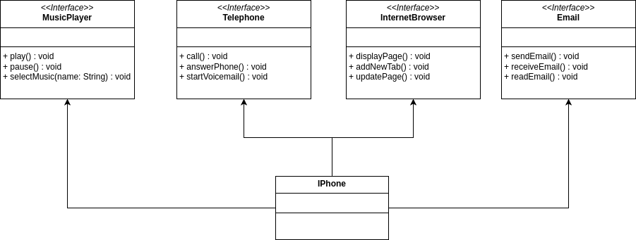

# Sobre a aplicação

Este aplicativo implementa as funcionalidades de um IPhone utilizando o conceito de interfaces, pois no caso específico o IPhone desempenha funcionalidade de vários tipos de equipamentos diferentes.

# Diagrama UML

Abaixo está o diagrama UML mostrando as diversas funcionalidades que ele possui.

# Execução do programa

Execute o arquivo src/App.java para iniciar a aplicação.
